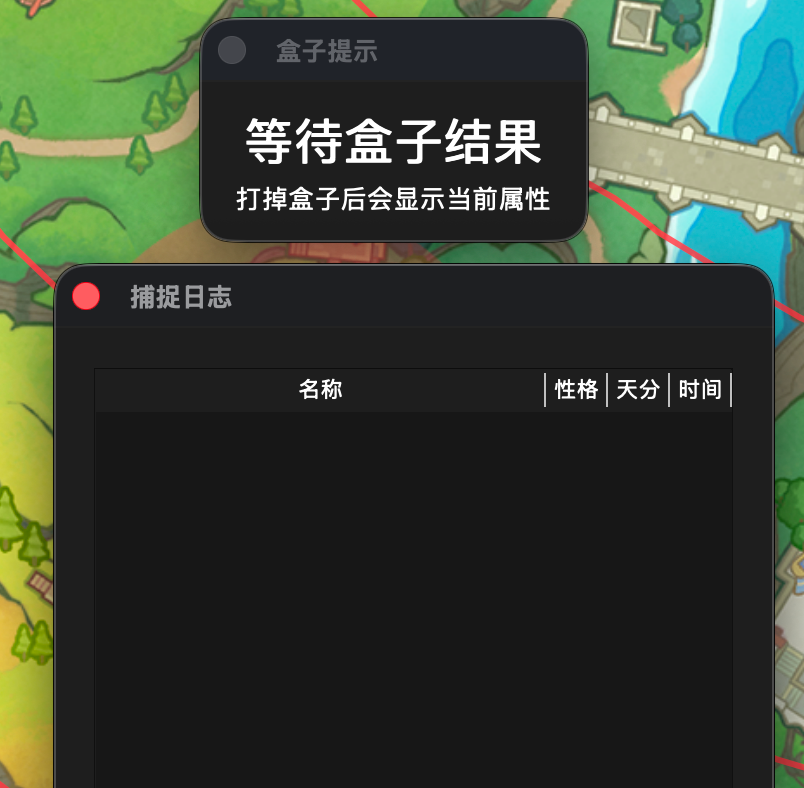

# 洛克王国世界助手

基于流量解析实现的洛克王国世界助手，小地图、路径显示、资源自动标注、宠物筛选、S2盒子属性显示、异色提示、捕捉日志

> [!NOTE]
> 软件仅支持 Windows（x86_64）、macOS（arm64）
>
> Android、iOS 用户可在 PC 端安装代理工具实现对移动端流量的解析

> [!IMPORTANT]
> Windows 用户须安装 [Npcap](https://npcap.com/#download)，安装时勾选 `Install Npcap in WinPcap API-compatilbility mode`

## 下载

- Windows：[roco_helper.exe](https://github.com/h3110w0r1d-y/rocom-helper/releases/download/V1.0/roco_helper.exe)
- macOS：[roco_helper.app.zip](https://github.com/h3110w0r1d-y/rocom-helper/releases/download/V1.0/roco_helper.app.zip)

## 功能介绍

本工具基于流量解析实现，不读游戏内存，不修改任何内容。

  
主界面

  默认解析默认路由所在的网卡，如果网卡错误，可停止解析后选择正确的网卡再开启。

  开启 `小地图模式` 会隐藏小地图的顶部工具栏。

  开启 `显示轨迹` 后，会将角色移动路径以半透明遮罩的形式叠加在地图上方，可以清楚的看出哪些地方走过，哪些地方没走过。
  可以动态调整轨迹宽度，260px 和资源刷新的距离基本一致

  `导入path` 可以导入一个 SVG 文件，将SVG中的Path叠显示到地图上，角色可跟随设定的路径移动，
  在导入path后，角色移动过程中控制台会输出建议转动角度，有能力的可以自己编写脚本读取控制台输出结果，控制鼠标移动实现自动跑图找炫彩。
  目前没有计划放出相关脚本和对应硬件外设实现方法。

  点位显示中，对花朵进行了分类，可以直接根据想要合成的球来控制是否显示。点位可以自己添加，也可以跑一遍地图，自动识别并标记附近的资源。

  

  
小地图

  开启 `跟踪角色` 后，游戏中角色移动时会保持角色在地图中间。

  开启 `标点模式` 后，点击地图可手动标记点位。勾选 `临时标记` 是，手动标记的点位不会持久化，重启工具消失。

  自动识别的附近宝箱数据是临时标记，重启消失，矿石和花朵标记是永久标记，下次开启时还会显示。按住Shift拖动可以框选，批量删除

  

  以下是导入path、开启显示轨迹后的效果。旋转建议：正向右，负向左

  

  
宠物筛选

  不多介绍了，看图吧，筛选条件很灵活。宠物数据与游戏中实时更新。

  

  
盒子显示、捕捉日志

  

