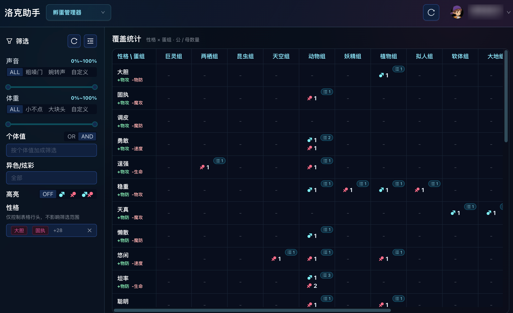

# 洛克王国世界助手

基于流量解析实现的洛克王国世界助手，宠物全维度筛选(自动导入)、孵蛋覆盖表、S2盒子属性显示、异色提示、产蛋时间查看

> [!IMPORTANT]
> PC端直接使用有封号风险，推荐通过以下几种方式使用：
> - 用电脑开热点，移动端连接电脑热点
> - 软路由 Docker 部署（仅arm64/amd64架构）
> - 用Reqable等代理软件让流量从电脑上走
>
> 需要在点击 `进入世界` 前打开工具

> [!IMPORTANT]
> Windows 用户须安装 [Npcap](https://npcap.com/#download)，安装时勾选 `Install Npcap in WinPcap API-compatilbility mode`

> [!NOTE]  
> 仅做PVE、地图资源采集、宠物筛选相关功能，不会做PVP相关、影响游戏平衡性的功能

## 交流群

有问题加群讨论吧，及时一点，939403587

## 下载

- Docker: [docker-compose.yml](docker-compose.yml)
- Windows：[roco_helper.exe](https://github.com/h3110w0r1d-y/rocom-helper/releases/latest/download/roco_helper.exe)
- macOS：[roco_helper.app.zip](https://github.com/h3110w0r1d-y/rocom-helper/releases/latest/download/roco_helper.app.zip)

## 功能介绍

本工具基于流量解析实现，不读游戏内存，不修改任何内容，可通过 Docker 部署到软路由

### Linux版 CLI

```shell
./roco_helper --interface=<监听网卡> --bind=<WEB绑定地址> --port=<WEB端口> --database=<数据目录>
```

### 桌面端主界面


### 宠物管理

#### 宠物筛选

支持通过 自定义名称、精灵名称、进化链、等级、声音、体重、性别、系别、性格、个体值、血脉、蛋组、咕噜球、天分、技能、特长、佩戴的奖牌、盒子、标记 进行筛选


#### 孵蛋覆盖




## 赞助

<details>
    <summary>点击展开二维码</summary>
    
    
</details>
