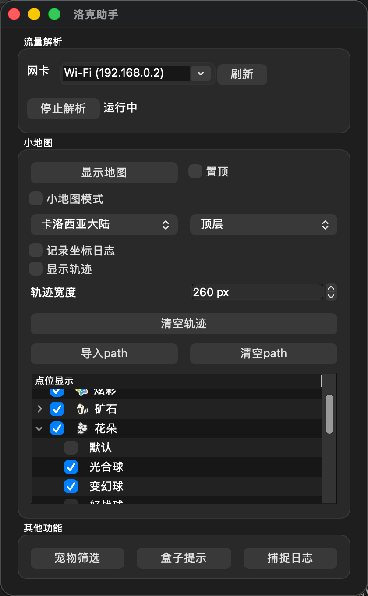

# 洛克王国世界助手

基于流量解析实现的洛克王国世界助手，小地图、路径显示、资源自动标注、宠物全维度筛选(自动导入)、孵蛋覆盖表、S2盒子属性显示、异色提示、捕捉日志

> [!IMPORTANT]
> PC端直接使用有封号风险，建议用手机玩游戏，用电脑运行工具，电脑开热点（理论上可完全避免被封）或用Reqable等方式让流量从电脑上走
>
> 需要在点击 `进入世界` 前打开工具

> [!IMPORTANT]
> Windows 用户须安装 [Npcap](https://npcap.com/#download)，安装时勾选 `Install Npcap in WinPcap API-compatilbility mode`

> [!NOTE]  
> 仅做PVE、地图资源采集、宠物筛选相关功能，不会做PVP相关、影响游戏平衡性的功能

## 交流群

有问题加群讨论吧，及时一点，939403587

## 下载

### [有用户反馈被封号，谨慎使用，推荐用热点或Reqable在移动端玩游戏](https://bbs.nga.cn/read.php?tid=46955980)

- Windows：[roco_helper.exe](https://github.com/h3110w0r1d-y/rocom-helper/releases/latest/download/roco_helper.exe)
- macOS：[roco_helper.app.zip](https://github.com/h3110w0r1d-y/rocom-helper/releases/latest/download/roco_helper.app.zip)

## 功能介绍

本工具基于流量解析实现，不读游戏内存，不修改任何内容，可“旁路部署”避免被检测

小地图、盒子提示、捕捉日志窗口，点击标题栏的`悬浮`按钮可开启鼠标穿透模式，防止卡鼠标

### 主界面

默认解析默认路由所在的网卡，如果网卡错误，可停止解析后选择正确的网卡再开启。

开启 `小地图模式` 会隐藏小地图的顶部工具栏。

开启 `记录轨迹` 后，会将角色移动路径以半透明遮罩的形式叠加在地图上方，可以清楚的看出哪些地方走过，哪些地方没走过。
可以动态调整轨迹宽度，260px 和资源刷新的距离基本一致

`导入路径` 可以导入一个 SVG 文件，将SVG中的path、polygon路径叠加到地图上，方便进行跟跑，
在导入路径后，角色移动过程中控制台会输出建议转动角度，有能力的可以自己编写脚本读取控制台输出结果，控制鼠标移动实现自动跑图找炫彩。
目前没有计划放出相关脚本和对应硬件外设实现方法。

点位显示中，对花朵进行了分类，可以直接根据想要合成的球来控制是否显示。点位可以自己添加，也可以跑一遍地图，自动识别并标记附近的资源。

### 小地图

开启 `跟踪角色` 后，游戏中角色移动时会保持角色在地图中间。

开启 `标点模式` 后，点击地图可手动标记点位。勾选 `临时标记` 时，手动标记的点位不会持久化，重启工具后消失。

自动识别的附近宝箱数据是临时标记，重启消失，矿石和花朵标记是永久标记，下次开启时还会显示。按住Shift拖动可以框选，批量删除

以下是导入path、开启显示轨迹后的效果。旋转建议：正向右，负向左

### 宠物管理

#### 宠物筛选

支持通过 自定义名称、精灵名称、进化链、等级、声音、体重、性别、系别、性格、个体值、血脉、蛋组、咕噜球、天分、技能、特长、佩戴的奖牌 进行筛选

#### 孵蛋覆盖

### 其他功能

## 赞助

    
点击展开二维码

    
    

